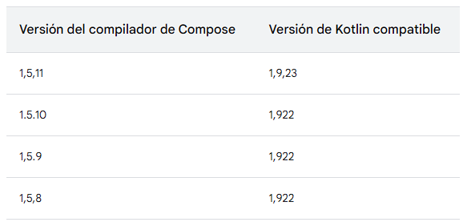

# `StudyHub  |  Proyecto 2024`

## `Tecnologías Utilizadas`

### `Android Studio Iguana`

### `Kotlin`


### `Jetpack Compose`

### `Gradle`

### `Java`

### `Android SDK`

### `XML`

### `Material3 Components`

[Referencia](https://developer.android.com/develop/ui/compose/components?hl=es-419)

Compatibilidad Kotlin vs Jetpack Compose



[Referencia](https://developer.android.com/jetpack/androidx/releases/compose-kotlin?hl=es-419)

`Gradle`

```sh
./gradlew assembleDebug      # Compilar y genera un archivo APK de depuración en app/build/outputs/apk/debug
./gradlew assembleRelease    # Compilar y genera un archivo APK en app/build/outputs/apk/release
```

```sh
./gradlew compileDebugKotlin  # Compila todos los archivos Kotlin en tu módulo para la variante de depuración
./gradlew installDebug        # Compila e instala la versión de depuración de tu aplicación en el dispositivo conectado
```

```sh
./gradlew clean # Limpiar tu proyecto Gradle, eliminando todos los archivos del directorio build
```


Version minima comaptible con Kotlin y Gradle
| Gradle | Kotlin Embedded | Kotlin Language |
| :----: | :-------------: | :-------------: |
|   8.7  |      1.9.22     |       1.8       |
|   8.5  |      1.9.20     |       1.8       |
|   8.4  |      1.9.10     |       1.8       |
|   8.3  |      1.9.0      |       1.8       |
|   8.2  |      1.8.20     |       1.8       |
|   8.0  |      1.8.10     |       1.8       |
|   7.6  |      1.7.10     |       1.4       |
|   7.5  |      1.6.21     |       1.4       |
|   7.3  |      1.5.31     |       1.4       |
|   7.2  |      1.5.21     |       1.4       |
|   7.0  |      1.4.31     |       1.4       |
|   6.8  |      1.4.20     |       1.3       |
|   6.5  |      1.3.72     |       1.3       |
|   6.4  |      1.3.71     |       1.3       |
|   6.3  |      1.3.70     |       1.3       |
|   6.1  |      1.3.61     |       1.3       |
|   6.0  |      1.3.50     |       1.3       |
|   5.6  |      1.3.41     |       1.3       |
|   5.5  |      1.3.31     |       1.3       |
|   5.3  |      1.3.21     |       1.3       |
|   5.2  |      1.3.20     |       1.3       |
|   5.1  |      1.3.11     |       1.3       |
|   5.0  |      1.3.10     |       1.3       |


```sh
kotlin versoin 1.9.20
```